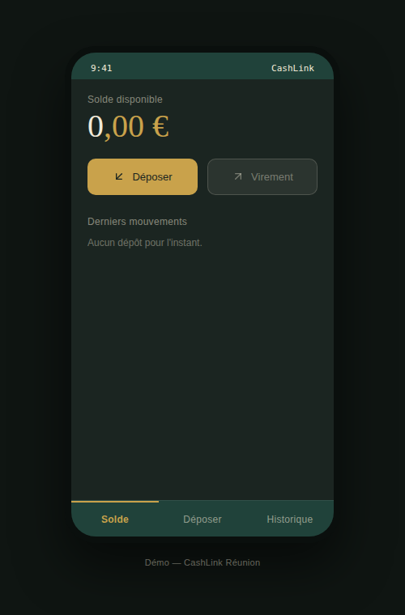
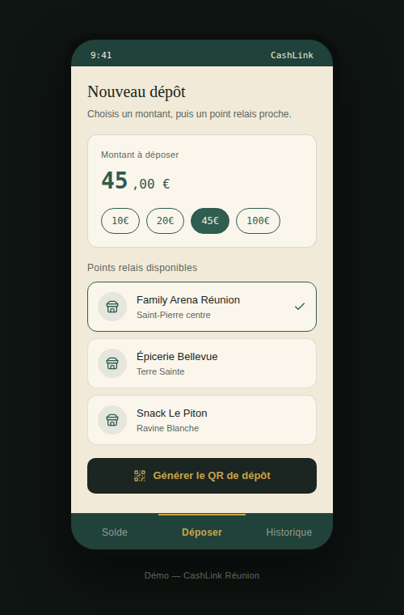
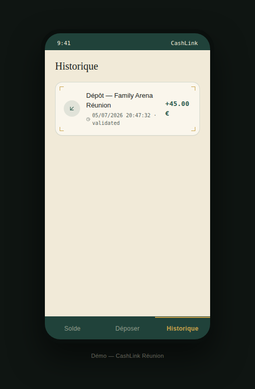

# CashLink Réunion

Prototype full-stack d'une app permettant de déposer des espèces via un
réseau de points relais locaux, sans passer par un distributeur ou une
agence bancaire.

> **Projet de démonstration / portfolio.** Ce dépôt montre l'architecture,
> le parcours utilisateur et le code d'un MVP. Il ne traite aucun argent
> réel — voir la section [Notice réglementaire](#notice-réglementaire) plus
> bas, qui fait partie intégrante du projet.

---

## Le problème

À La Réunion (et ailleurs), déposer des espèces sur un compte impose de se
déplacer vers un distributeur compatible ou une agence, avec des horaires
contraints. CashLink propose un réseau de commerces partenaires ("points
relais") qui acceptent le cash et créditent l'utilisateur instantanément
dans l'app, à charge pour eux de déposer les espèces en banque ensuite.

**Ce que ce projet ne prétend pas faire :** transformer un billet en argent
numérique par simple scan. Un billet physique doit toujours être remis à un
tiers de confiance — l'app sert à fiabiliser et fluidifier cette remise
(QR code de dépôt, traçabilité, crédit instantané), pas à s'en passer.

## Aperçu

| Solde | Dépôt | Historique |
|---|---|---|
|  |  |  |

*(voir `/docs` pour les captures d'écran)*

## Fonctionnement du parcours

1. L'utilisateur choisit un montant et un point relais actif sur la carte.
2. L'app génère un QR code de dépôt (référence unique).
3. L'utilisateur présente le billet + le QR au partenaire.
4. Le partenaire valide le dépôt côté back-office → le solde utilisateur
   est crédité instantanément.
5. L'historique conserve chaque transaction avec sa référence.

Dans ce dépôt, l'étape 4 (validation partenaire) est simulée par un bouton
dans l'app elle-même, pour permettre une démo sans deuxième interface —
voir [Limites de la démo](#limites-de-la-démo).

## Stack technique

**Backend** — `backend/`
- FastAPI + SQLAlchemy + SQLite (facilement remplaçable par Postgres)
- 3 ressources : `users`, `relais`, `deposits`
- Documentation interactive auto-générée (`/docs`, Swagger)

**Frontend** — `frontend/`
- React 18 + Vite
- Tailwind CSS (design system "billet" : vert/doré, police Fraunces + IBM
  Plex)
- Génération de QR code côté client (`qrcode`)

```
cashlink-portfolio/
├── backend/
│   ├── app/
│   │   ├── main.py          # point d'entrée FastAPI
│   │   ├── models.py        # modèles SQLAlchemy
│   │   ├── schemas.py       # schémas Pydantic
│   │   └── routers/         # users / relais / deposits
│   ├── seed.py               # données de démo
│   └── requirements.txt
├── frontend/
│   ├── src/
│   │   ├── components/       # écrans de l'app (Accueil, Dépôt, Historique...)
│   │   ├── api.js            # client API
│   │   └── App.jsx
│   └── package.json
└── docs/                      # cahier des charges, captures d'écran
```

## Lancer le projet en local

### Backend

```bash
cd backend
python3 -m venv .venv && source .venv/bin/activate
pip install -r requirements.txt
python seed.py          # crée quelques points relais de démo
uvicorn app.main:app --reload --port 8000
```

L'API est disponible sur `http://localhost:8000`, documentation Swagger sur
`http://localhost:8000/docs`.

### Frontend

```bash
cd frontend
npm install
npm run dev
```

L'app est disponible sur `http://localhost:5173`. Créer un compte de démo
au premier lancement, puis tester le parcours de dépôt avec les points
relais pré-remplis (dont "Family Arena Réunion").

## Limites de la démo

Ce projet est un **prototype d'architecture et de parcours**, pas un
produit en production. En particulier :

- La validation d'un dépôt est déclenchée depuis l'app elle-même (bouton
  "simuler la validation partenaire") plutôt que depuis une vraie interface
  partenaire séparée et authentifiée.
- Aucun vrai virement bancaire n'est effectué : `balance_cents` est un
  solde interne à la base de démo.
- Il n'y a pas de vérification d'identité (KYC) ni de contrôle
  anti-blanchiment (LCB-FT), obligatoires dans une vraie mise en
  production.

## Notice réglementaire

**Ce point est volontairement mis en avant plutôt que caché.** Manipuler
l'argent d'autrui et le convertir en monnaie électronique est une activité
réglementée en France (Code monétaire et financier). Une mise en
production réelle nécessiterait :

- un agrément établissement de paiement / établissement de monnaie
  électronique (ACPR, Banque de France), ou un partenariat avec un
  établissement déjà agréé ;
- des procédures KYC et de vigilance anti-blanchiment (LCB-FT) ;
- un hébergement et une gestion des données conformes RGPD.

Ce dépôt ne constitue donc pas un produit financier prêt à l'emploi, mais
une démonstration technique et produit destinée à un usage pédagogique /
portfolio, et à servir de base de discussion avec un partenaire agréé.

## Roadmap

- [ ] Interface partenaire séparée et authentifiée pour la validation des
      dépôts
- [ ] Détection basique de falsification de billets par photo
- [ ] Demande de collecte à domicile
- [ ] Intégration avec un prestataire de paiement agréé pour les virements
      sortants réels

## Cahier des charges complet

Voir [`docs/CashLink_Cahier_des_charges.docx`](docs/CashLink_Cahier_des_charges.docx)
pour la spécification détaillée (contexte, fonctionnalités, modèle
économique, risques).

## Auteur

Projet réalisé par Clems, étudiant en Terminale CIEL, La Réunion.

## Licence

MIT — voir [`LICENSE`](LICENSE).
